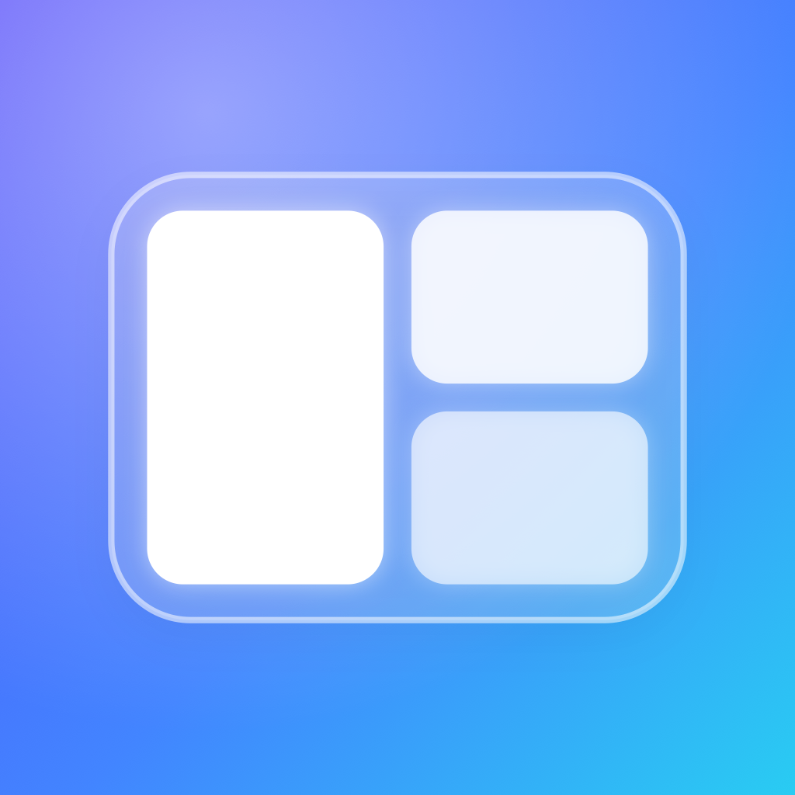
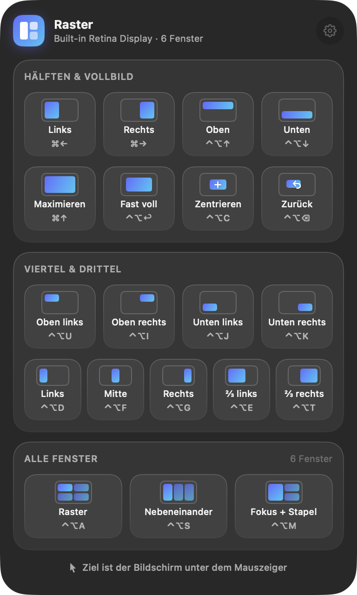
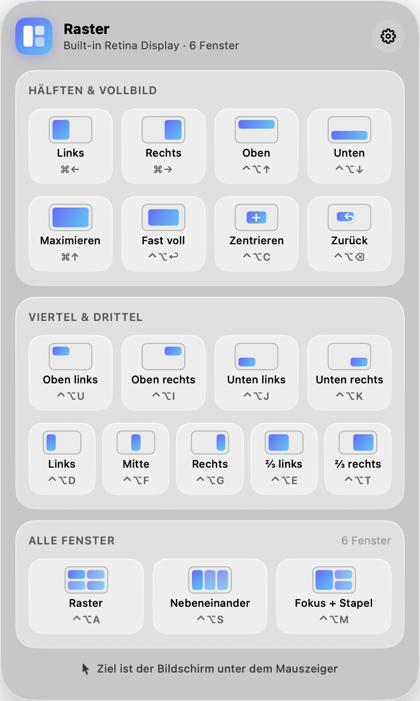
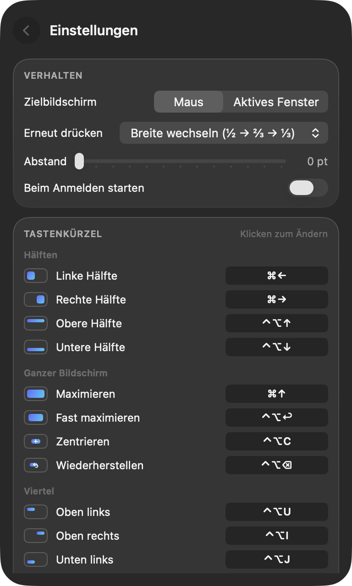
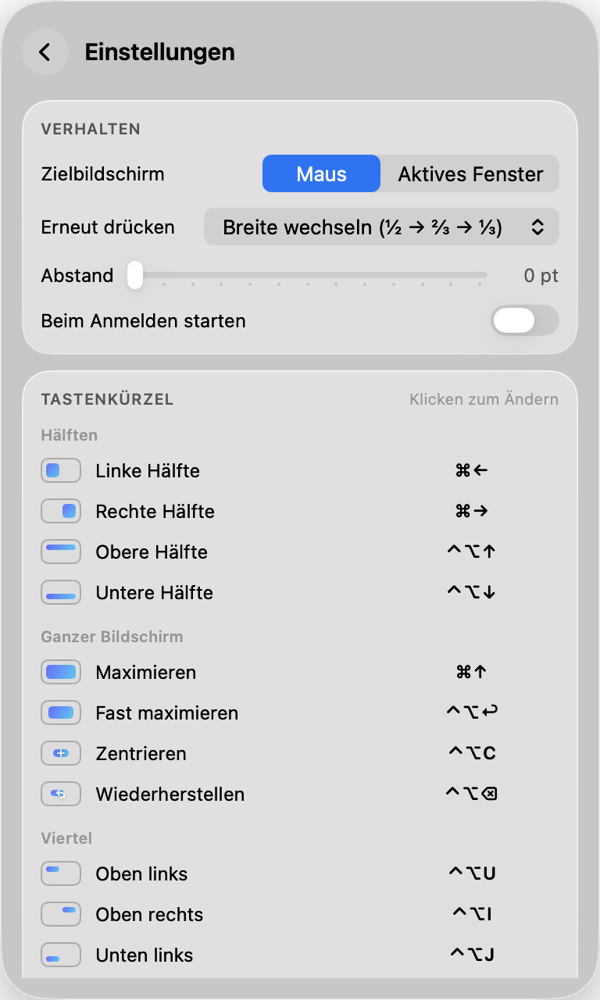

<p align="center">
  
</p>

<h1 align="center">Raster</h1>

<p align="center">
  Fenster per Tastenkürzel auf Hälften, Viertel und Drittel legen – oder alle Fenster eines Bildschirms auf einmal aufteilen.<br>
  Eine schlanke Menüleisten-App im Liquid-Glass-Design von macOS 26.
</p>

<p align="center">
  <a href="https://github.com/QVllasa/raster/releases/latest"><b>⬇︎ Raster herunterladen</b></a> ·
  macOS 26 Tahoe · Apple Silicon &amp; Intel · Deutsch &amp; Englisch · kostenlos &amp; Open Source (MIT)<br>
  Bald auch im Mac App Store · <a href="https://qvllasa.github.io/raster/">Website</a>
</p>

<p align="center">
  
  
</p>

## Was Raster kann

- **⌘← / ⌘→** legen das aktive Fenster auf die linke bzw. rechte Bildschirmhälfte, **⌘↑** maximiert es – ein zweites ⌘↑ stellt die alte Größe wieder her.
- **Erneut drücken** wechselt die Breite: ½ → ⅔ → ⅓ (oder, wenn gewünscht, springt das Fenster zum Nachbarbildschirm – wie unter Windows).
- **Viertel, Drittel, zwei Drittel, fast maximiert, zentriert, wiederherstellen** – jeweils mit eigenem Kürzel.
- **Alle Fenster eines Bildschirms** auf einmal: als Raster, nebeneinander in Spalten oder „Fokus + Stapel“ (aktives Fenster links, der Rest rechts übereinander).
- **Mehrere Bildschirme:** Maßgeblich ist der Bildschirm **unter dem Mauszeiger** (umstellbar auf „Bildschirm des aktiven Fensters“). Fenster lassen sich per Kürzel auf den nächsten/vorherigen Bildschirm schieben; Größe und Lage werden dabei proportional übertragen.
- **Abstand** zwischen den Fenstern einstellbar (0–24 pt).
- **Alle Kürzel änderbar:** Klick auf ein Kürzel in den Einstellungen, neue Kombination drücken – fertig. ⌫ löscht, ⎋ bricht ab.
- **Startet mit dem Mac** und bleibt still in der Menüleiste. Rechtsklick aufs Symbol → „Tastenkürzel pausieren“, falls du ⌘←/⌘→ kurz wieder zum Springen an den Zeilenanfang brauchst.

### Standard-Kürzel

| Anordnung | Kürzel | | Anordnung | Kürzel |
|---|---|---|---|---|
| Linke Hälfte | **⌘←** | | Oben links / oben rechts | ⌃⌥U / ⌃⌥I |
| Rechte Hälfte | **⌘→** | | Unten links / unten rechts | ⌃⌥J / ⌃⌥K |
| Maximieren | **⌘↑** | | Linkes / mittleres / rechtes Drittel | ⌃⌥D / ⌃⌥F / ⌃⌥G |
| Obere / untere Hälfte | ⌃⌥↑ / ⌃⌥↓ | | Linke / rechte zwei Drittel | ⌃⌥E / ⌃⌥T |
| Fast maximieren | ⌃⌥↩ | | Nächster / vorheriger Bildschirm | ⌃⌥⌘→ / ⌃⌥⌘← |
| Zentrieren | ⌃⌥C | | Alle Fenster als Raster | ⌃⌥A |
| Wiederherstellen | ⌃⌥⌫ | | Alle nebeneinander / Fokus + Stapel | ⌃⌥S / ⌃⌥M |

<p align="center">
  
  
</p>

## Installation

1. [`Raster-x.y.z.zip` aus dem neuesten Release](https://github.com/QVllasa/raster/releases/latest) laden, entpacken und `Raster.app` in den Ordner **Programme** ziehen.
2. Raster ist frei verteilt und nicht bei Apple notariell beglaubigt. Beim ersten Start meldet macOS deshalb, dass die App nicht überprüft werden konnte. So öffnest du sie trotzdem:
   - **Systemeinstellungen → Datenschutz & Sicherheit →** ganz unten bei „Raster wurde blockiert“ auf **Trotzdem öffnen** klicken, **oder**
   - im Terminal: `xattr -dr com.apple.quarantine /Applications/Raster.app`
3. Raster fragt nach der Freigabe **Bedienungshilfen** (Systemeinstellungen → Datenschutz & Sicherheit → Bedienungshilfen → Raster einschalten). Ohne sie darf keine App die Fenster anderer Apps verschieben. Sobald der Schalter an ist, funktionieren die Kürzel – kein Neustart nötig.

Voraussetzung ist **macOS 26 (Tahoe)** oder neuer, weil Raster das neue Liquid-Glass-Material nutzt.

## Datenschutz

Raster sammelt nichts, sendet nichts und stellt keine einzige Netzwerkverbindung her. Die Freigabe „Bedienungshilfen“ wird ausschließlich genutzt, um Position und Größe von Fenstern zu lesen und zu setzen. Der gesamte Quelltext liegt hier – rund 2 600 Zeilen Swift, ohne Fremdbibliotheken.

## Selbst bauen

Es reichen die Command Line Tools (`xcode-select --install`), Xcode ist nicht nötig.

```sh
git clone https://github.com/QVllasa/raster.git && cd raster
swift build                       # Entwicklungs-Build
.build/debug/Raster --selftest    # prüft Geometrie, Bildschirmwahl, Kürzel und Einstellungen
scripts/build-app.sh              # Universal-App nach dist/Raster.app + ZIP
scripts/install.sh                # nach /Programme kopieren und starten
```

`--snapshot <ordner> [--light|--dark] [--window-only]` erzeugt die Screenshots dieser Seite, `RASTER_DEBUG=1` schreibt ein Diagnoseprotokoll, `--ax-probe <pid>` prüft, ob Raster die Fenster einer bestimmten App bewegen darf.

**Release bauen:** `scripts/notarize.sh` signiert mit Developer ID (Hardened Runtime), lässt Apple notarisieren und packt das ZIP (einmalig vorher `scripts/import-devid.sh`).

**Mac App Store:** `scripts/build-appstore.sh` baut die Store-Version: Sandbox ohne jede Ausnahme und ohne Accessibility – Fenster liest sie über die Fensterliste (CGWindowList) und bewegt sie über den mitgelieferten Kurzbefehl „Raster“ (Apples Aktionen „Fenster suchen / bewegen / Größe ändern“, erzeugt von `scripts/make-shortcut.py`). `scripts/asc_submit.py` erledigt Texte, Screenshots und Einreichung über die App-Store-Connect-API. Hintergrund und Messwerte: [docs/app-store-bewertung.md](docs/app-store-bewertung.md).

**Tipp für Selbstbauer:** Mit einer ad-hoc-Signatur verfällt die Bedienungshilfen-Freigabe bei jedem Neubau. `scripts/build-app.sh` nutzt deshalb eine lokale Signatur-Identität „Raster Local Signing“ aus `~/Library/Keychains/raster-signing.keychain-db`, falls vorhanden – dann bleibt die Freigabe über Updates hinweg gültig.

## Wie es funktioniert

- **Globale Kürzel** über `RegisterEventHotKey` (Carbon) – braucht keine Freigabe und hat Vorrang vor den Kürzeln der Apps.
- **Fenster** über die Accessibility-API (`AXUIElement`): Größe → Position → Größe setzen, damit Fenster auch beim Wechsel auf einen kleineren Bildschirm sauber landen; Fenster mit Mindestgröße werden an der passenden Kante ausgerichtet.
- **Alle Fenster eines Bildschirms** über `CGWindowListCopyWindowInfo` (sichtbare Fenster in Z-Reihenfolge), zugeordnet über die Fensternummer.
- **Bildschirmwahl** rein rechnerisch (`ScreenGeometry`, `WindowPlanner`) und mit `--selftest` geprüft – inklusive übereinander und versetzt angeordneter Monitore.

## Lizenz

[MIT](LICENSE) – du darfst Raster frei benutzen, verändern und weitergeben.

---

<details>
<summary><b>English</b></summary>

**Raster** is a lightweight window manager for the macOS menu bar with a Liquid Glass design (macOS 26+). ⌘← / ⌘→ snap the focused window to the left/right half, ⌘↑ maximizes (press again to restore). Press a half again to cycle ½ → ⅔ → ⅓, or optionally move to the neighboring display. Quarters, thirds, two-thirds, almost-maximize, center, restore, move to next/previous display, and tiling *all* windows of a display (grid, columns, focus + stack) are included. With multiple displays, the display under the mouse pointer is used (or, optionally, the focused window's display). All shortcuts are customizable. The UI is available in English and German.

**Install:** download the ZIP from the [latest release](https://github.com/QVllasa/raster/releases/latest), move `Raster.app` to Applications. The app is not notarized, so allow it once via *System Settings → Privacy & Security → Open Anyway*, or run `xattr -dr com.apple.quarantine /Applications/Raster.app`. Then grant *Accessibility* permission when asked.

**Build:** `swift build` (Command Line Tools are enough), `.build/debug/Raster --selftest`, `scripts/build-app.sh` for a universal app bundle.

No telemetry, no network access at all. MIT licensed.
</details>
